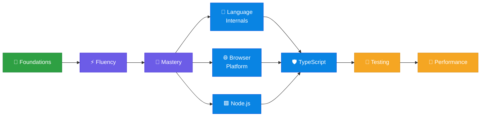

# 🛣️ Road to JS Master 

**A curated roadmap of the best JavaScript books — from your first `console.log()` to production-grade engineering.**

Searching for the <b>best JavaScript books</b>, <b>top JS books</b>, or a <b>JavaScript learning path</b>? You're in the right place.

---

## 🗺️ The Roadmap

### 🎯 Where should I start?

| If this sounds like you… | Start here |
| :-- | :-- |
| 🐣 I've never written code before | [Stage 1 · Foundations](#foundations) |
| 🧩 I can write JS, but I copy-paste a lot | [Stage 2 · Fluency](#fluency) |
| 🤔 I know *what* JS does, not *why* | [Stage 3 · Mastery](#mastery) · [Stage 4 · Internals](#internals) |
| 🖥️ I want to build for the browser | [Stage 5 · Browser Platform](#browser) |
| 🖧 I want to build servers and CLIs | [Stage 6 · Node.js](#nodejs) |
| 🏭 I ship to real users and it hurts | [Stage 7](#typescript) → [8](#testing) → [9](#performance) |

---

## 📚 Contents

| Stage | Track | Books |
| :--: | :-- | :--: |
| 1 | [🌱 Foundations](#foundations) | 4 |
| 2 | [⚡ Fluency](#fluency) | 4 |
| 3 | [🧠 Mastery](#mastery) | 3 |
| 4 | [🔬 JavaScript in Depth](#internals) | 3 |
| 5 | [🌐 Web APIs & Browser](#browser) | 2 |
| 6 | [🟩 Node.js](#nodejs) | 2 |
| 7 | [🛡️ TypeScript](#typescript) | 2 |
| 8 | [🧪 Testing](#testing) | 2 |
| 9 | [🚀 Performance & Reliability](#performance) | 2 |

➕ [🔗 Resources](#resources) · [🤝 Contributing](#contributing) · [⚖️ License](#license)

---

## 🌱 Stage 1 · Foundations

> **Goal:** write your first hundred programs without fear. Variables, functions, loops, and the habit of shipping something that runs.

| Book | Access | Why it earns your time |
| :-- | :--: | :-- |
| **[Eloquent JavaScript (4th Edition)](https://eloquentjavascript.net/)** |  | A modern introduction to programming with lots of exercises and small projects. Great if you want practice, not just theory. |
| **[The JavaScript Tutorial](https://javascript.info/)** |  | A structured online "book" that starts from fundamentals and builds toward real-world language and browser topics. |
| **[JavaScript for Kids](https://nostarch.com/javascriptforkids)** |  | A friendly, hands-on introduction that teaches core programming ideas through small games and visual examples. |
| **[Head First JavaScript Programming](https://www.oreilly.com/library/view/head-first-javascript/9781449340124/)** |  | A highly visual, beginner-friendly approach that helps concepts stick through exercises and puzzles. |

<a href="#contents">⬆️ back to contents</a>

---

## ⚡ Stage 2 · Fluency

> **Goal:** stop fighting the language. Scope, closures, `this`, async, and how to structure code someone else can read.

| Book | Access | Why it earns your time |
| :-- | :--: | :-- |
| **[You Don't Know JS Yet (2nd Edition)](https://github.com/getify/You-Dont-Know-JS)** |  | A deep-dive series that explains *why* JavaScript behaves the way it does (scope, closures, types, async). Perfect once you've written some JS and want to level up. |
| **[Effective JavaScript](https://www.oreilly.com/library/view/effective-javascript/9780132902250/)** |  | 68 practical tips that improve correctness, readability, and maintainability. Focuses on the sharp edges and best practices. |
| **[JavaScript: The Definitive Guide](https://www.oreilly.com/library/view/javascript-the-definitive/9781491952016/)** |  | A comprehensive reference that covers the language plus the important web platform APIs. |
| **[Learning JavaScript Design Patterns](https://addyosmani.com/resources/essentialjsdesignpatterns/book/)** |  | Classic patterns and practical guidance for structuring applications, plus common anti-patterns to avoid. |

<a href="#contents">⬆️ back to contents</a>

---

## 🧠 Stage 3 · Mastery

> **Goal:** build the mental models. Know the language's history, its traps, and the machinery underneath the DOM.

| Book | Access | Why it earns your time |
| :-- | :--: | :-- |
| **[JavaScript: The Good Parts](https://www.oreilly.com/library/view/javascript-the-good/9780596517748/)** |  | A short, opinionated classic that highlights the powerful ideas in the language — and the pitfalls. Useful for historical context and fundamentals. |
| **[JavaScript Enlightenment](https://frontendmasters.com/books/javascript-enlightenment/)** |  | A compact, detail-oriented exploration of the language's tricky parts — great for strengthening mental models. |
| **[DOM Enlightenment](http://domenlightenment.com/)** |  | A focused technical guide to the DOM, events, and the realities of browser scripting. |

<a href="#contents">⬆️ back to contents</a>

---

## 🔬 Stage 4 · JavaScript in Depth

> **Goal:** read the spec without flinching. Where ES features came from and what problem each one solved.

| Book | Access | Why it earns your time |
| :-- | :--: | :-- |
| **[Speaking JavaScript](http://speakingjs.com/es5/)** |  | A detailed guide for programmers coming from other languages; explains JS concepts, idioms, and common patterns. |
| **[Exploring ES6](https://exploringjs.com/es6.html)** |  | A thorough walkthrough of ES2015 features and how they changed modern JavaScript. |
| **[Understanding ECMAScript 6](https://www.nostarch.com/understandinges6)** |  | A clear explanation of ES6 features with examples and rationale — good if you want a book rather than an online guide. |

<a href="#contents">⬆️ back to contents</a>

---

## 🌐 Stage 5 · Web APIs & Browser

> **Goal:** the platform is bigger than the language. Fetch, storage, canvas, events, and everything MDN documents.

| Reference | Access | Why it earns your time |
| :-- | :--: | :-- |
| **[MDN Web Docs: JavaScript Guide](https://developer.mozilla.org/en-US/docs/Web/JavaScript/Guide)** |  | The go-to reference for core language concepts, with examples and links to related Web APIs. |
| **[MDN Web Docs: Web APIs](https://developer.mozilla.org/en-US/docs/Web/API)** |  | Reference pages for DOM, events, fetch, storage, canvas, and many other browser APIs. |

<a href="#contents">⬆️ back to contents</a>

---

## 🟩 Stage 6 · Node.js

> **Goal:** take JavaScript server-side. Modules, streams, async patterns, and architecture that survives traffic.

| Book | Access | Why it earns your time |
| :-- | :--: | :-- |
| **[Node.js Design Patterns](https://nodejsdesignpatterns.com)** |  | A strong guide to building scalable Node applications with proven patterns, architecture, and async best practices. *A free chapter is available.* |
| **[The Node.js Handbook](https://www.freecodecamp.org/news/the-node-js-handbook/)** |  | A practical, fast-moving introduction to Node concepts, modules, npm, and building simple apps. |

<a href="#contents">⬆️ back to contents</a>

---

## 🛡️ Stage 7 · TypeScript

> **Goal:** let the compiler catch what your tests would have. Narrowing, generics, and types that document intent.

| Book | Access | Why it earns your time |
| :-- | :--: | :-- |
| **[TypeScript Handbook](https://www.typescriptlang.org/docs/handbook/intro.html)** |  | The official guide that explains the type system, narrowing, generics, and best practices. |
| **[Effective TypeScript](https://www.oreilly.com/library/view/effective-typescript/9781492053736/)** |  | A best-practices book focused on writing TypeScript that is safe, ergonomic, and maintainable. |

<a href="#contents">⬆️ back to contents</a>

---

## 🧪 Stage 8 · Testing

> **Goal:** refactor on a Friday without fear. Strategy first, tooling second.

| Book | Access | Why it earns your time |
| :-- | :--: | :-- |
| **[Testing JavaScript Applications](https://www.manning.com/books/testing-javascript-applications)** |  | A practical approach to testing strategy — unit, integration, UI, and tooling choices. |
| **[Jest Documentation](https://jestjs.io/docs/getting-started)** |  | Hands-on docs for unit and integration testing with a popular JavaScript test runner. |

<a href="#contents">⬆️ back to contents</a>

---

## 🚀 Stage 9 · Performance & Reliability

> **Goal:** the last mile. Measure what users feel, and understand the network you're shipping across.

| Book | Access | Why it earns your time |
| :-- | :--: | :-- |
| **[Web Performance 101](https://3perf.com/book)** |  | A modern performance primer: metrics, loading strategies, and real-world optimization techniques. |
| **[High Performance Browser Networking](https://hpbn.co/)** |  | A deep dive into how browsers and networks actually work (TCP/TLS/HTTP/2/3), and what that means for performance. |

<a href="#contents">⬆️ back to contents</a>

---

## ✅ Track Your Progress

Fork this repo and tick the boxes as you go:

- [ ] 🌱 **Stage 1 — Foundations:** I can build a small app from an empty file
- [ ] ⚡ **Stage 2 — Fluency:** closures, `this`, and `async/await` no longer surprise me
- [ ] 🧠 **Stage 3 — Mastery:** I know which "parts" to avoid and why
- [ ] 🔬 **Stage 4 — Internals:** I can read the ECMAScript spec for an answer
- [ ] 🌐 **Stage 5 — Browser:** I reach for the right Web API instead of a library
- [ ] 🟩 **Stage 6 — Node.js:** I've shipped a server or CLI that others use
- [ ] 🛡️ **Stage 7 — TypeScript:** my types document intent, not just shapes
- [ ] 🧪 **Stage 8 — Testing:** I refactor confidently because the suite has my back
- [ ] 🚀 **Stage 9 — Performance:** I optimize from measurements, not hunches

---

## 🔗 Resources

| Resource | What it's for |
| :-- | :-- |
| 📜 **[ECMAScript (Language Spec)](https://tc39.es/ecma262/)** | The official JavaScript specification — the final word on behavior. |
| 📊 **[Can I use](https://caniuse.com/)** | Browser support tables for Web platform features. |
| 📖 **[MDN Web Docs](https://developer.mozilla.org/)** | Reference and guides across the entire Web platform. |
| 🎓 **[Frontend Masters Book Collection](https://frontendmasters.com/books/)** | Several high-quality, free JS-related books. |

---

## 🤝 Contributing

Contributions are very welcome — this roadmap gets better with every pair of eyes.

**To add a book, open a PR that includes:**

| ✔️ | Requirement |
| :--: | :-- |
| 1️⃣ | **Title + link + access tag** (`Free` or `Paid`) |
| 2️⃣ | A **1–3 sentence original blurb** — no copy-paste from the publisher |
| 3️⃣ | An **official source** (author, publisher, or project site) over third-party mirrors |
| 4️⃣ | Placement in the **stage that matches its difficulty** |

Spotted a dead link, an outdated edition, or a book that belongs in a different stage? [Open an issue](https://github.com/zero-0002/Road_to_JS_Master/issues) — those PRs are just as valuable.

---

## ⚖️ License

Licensed under the **[Creative Commons Attribution 4.0 International License (CC BY 4.0)](LICENSE)**.

You are free to share and adapt this list — just give credit.

---

**⭐ If this roadmap helped you, star the repo — it helps other developers find it.**

Made for everyone walking the road from <code>console.log("hello")</code> to shipping JavaScript at scale.

